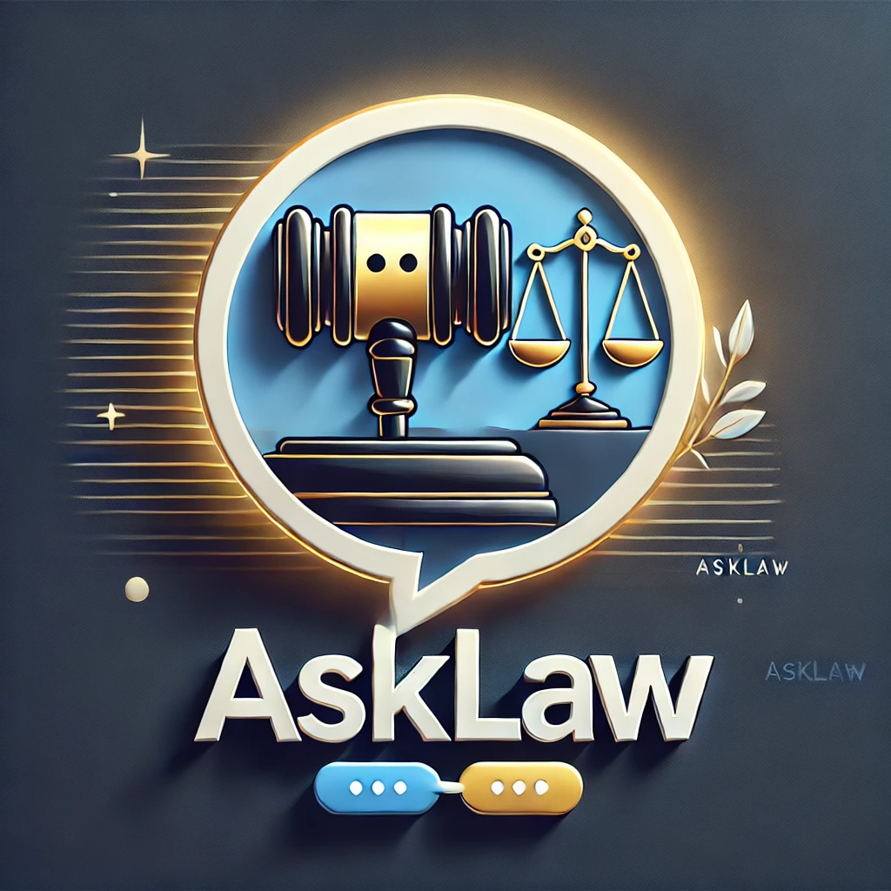

# AI Meets Law: Transforming Legal Research with RAG, Fine-Tuning, and Few-Shot Learning




## Project Overview
This project brings together state-of-the-art AI techniques like **Retrieval-Augmented Generation (RAG)**, **Fine-Tuning**, and **Few-Shot Learning (FSL)** to revolutionize the way legal research is conducted. By leveraging historical legal case data and constitutional texts, it enables lawyers and legal professionals to retrieve, analyze, and interpret legal information efficiently.

The system is designed to address the challenges of legal research, such as sifting through vast amounts of data and interpreting nuanced language. By combining retrieval capabilities with a fine-tuned language model, it provides insights, summaries, and even predictions with high accuracy and domain-specific expertise.

---

## Team Members
- **Saikrishna Paila**  
- **Aneri Patel**  
- **Srivallabh Siddharth N**

---

## Features
- **RAG Pipeline**: Combines embeddings and FAISS for fast and accurate document retrieval, supplemented by text summarization.
- **Fine-Tuning**: Customizes a GPT-4 model for legal tasks, improving its understanding of legal jargon and case-specific scenarios.
- **Few-Shot Learning (FSL)**: Leverages small curated datasets to provide detailed and nuanced responses.
- **Streamlit App**: Offers an easy-to-use graphical interface for both individual queries and bulk processing.
- **Batch Processing**: Handles JSON uploads to process multiple cases simultaneously, extracting key insights efficiently.

---

## Concepts Used

### **Retrieval-Augmented Generation (RAG)**
RAG combines document retrieval with generative language models. It first retrieves the most relevant documents for a user query using FAISS and embeddings, then passes these documents as context to a language model for generating a detailed response.

### **Few-Shot Learning (FSL)**
Few-shot learning allows the model to adapt to specific legal contexts by learning from a small set of curated examples. These examples guide the model to provide accurate, domain-specific responses.

### **Fine-Tuning**
Fine-tuning enhances a pre-trained GPT-4 model to specialize in legal tasks. This process adapts the model’s responses to legal terminologies, case formats, and reasoning patterns.

### **FAISS (Facebook AI Similarity Search)**
FAISS enables efficient similarity searches among vectorized documents. It ensures that the system can quickly find the most relevant legal documents by embedding both user queries and case data into a shared vector space.

### **Sentence Transformers**
Sentence Transformers are used to convert textual data (e.g., case opinions) into embeddings, which are numerical representations capturing the semantic meaning of text. These embeddings are crucial for similarity-based retrieval.

### **Natural Language Toolkit (NLTK)**
The Natural Language Toolkit (NLTK) is a Python library widely used for text preprocessing and analysis. Key functionalities include:
- **Tokenization**: Breaking down text into sentences or words for analysis.
- **Stemming and Lemmatization**: Reducing words to their base or root forms to standardize text.
- **Named Entity Recognition (NER)**: Identifying entities like case names, jurisdictions, dates, and legislation titles within legal documents.
- **Part-of-Speech (POS) Tagging**: Assigning grammatical labels (e.g., nouns, verbs, adjectives) to each word, helping understand the structure and context of legal sentences.

NLTK's features were critical for extracting structured information from unstructured legal texts, preparing them for embedding and retrieval.

---

## Tools and Technologies
- **Python**: Core programming language used for the pipelines and app.
- **LangChain**: Framework for chaining and managing LLM-based workflows.
- **FAISS**: For high-speed similarity searches in vectorized data.
- **Sentence Transformers**: Generates embeddings for text similarity tasks.
- **Beautiful Soup**: Used for scraping legal data from web sources.
- **Streamlit**: Builds the web-based interactive application.
- **Pandas and NumPy**: Used for data preprocessing and management.
- **Python-dotenv**: For managing environment variables like API keys.
- **Torch and Transformers**: For deep learning and model fine-tuning.

---

## Requirements

### **Dependencies with Versions**
```plaintext
# Core Language Model Libraries
openai==0.27.0
langchain==0.0.204
sentence-transformers==2.2.2

# Embedding and Similarity Search
faiss-cpu==1.7.3

# Natural Language Processing (NLP)
nltk==3.8.1
tiktoken==0.4.0

# Data Handling and Processing
numpy==1.23.5
pandas==1.5.2
pickle5==0.0.12

# Web Interface
streamlit==1.17.0

# Environment Variable Management
python-dotenv==0.21.0

# Deep Learning Frameworks
torch==1.13.1
transformers==4.25.1

# Utilities
pathlib2==2.3.7.post1
```

Install all required dependencies using:
```bash
pip install -r requirements.txt
```

### **Hardware Requirements**
- At least **16GB RAM** for handling large embeddings and datasets efficiently.

### **Additional NLTK Data Setup**
After installing `nltk`, ensure the required datasets are downloaded by running the following script:
```python
import nltk
nltk.download('punkt')
nltk.download('averaged_perceptron_tagger')
nltk.download('maxent_ne_chunker')
nltk.download('words')
```

---

## File Structure
- **`0840-01_arguments_only.json`**: Sample dataset containing legal arguments and metadata for testing.
- **`learning_examples.json`**: Few-shot learning examples for guiding the fine-tuned model.
- **`RAG.py`**: Implements the retrieval-augmented generation pipeline for query handling and summarization.
- **`RAG+FSL+Fine_tune.py`**: Fine-tunes the GPT-4 model and integrates FSL with the RAG pipeline.
- **`app.py`**: Streamlit-based user interface for querying and bulk case analysis.

---

## Workflow

### **Query Mode**
1. User enters a query (e.g., "What are the free speech rights in Virginia?").
2. The query is embedded and searched in the FAISS index for relevant legal documents.
3. Retrieved documents are summarized if needed and passed to the model.
4. The system generates a concise, contextually relevant response.

---

### **Test Case Mode**
1. User uploads a JSON file containing multiple legal cases.
2. The system:
   - Extracts and combines case opinions into a single query (if applicable).
   - Analyzes each case using the RAG pipeline.
   - Summarizes results and presents them to the user.

---

### **Fine-Tuning Workflow**
1. **Prepare Data**:
   - Preprocess data files, including `learning_examples.json`, to ensure clean and structured input.
   - Generate vector embeddings using `SentenceTransformer`.

2. **Train**:
   - Fine-tune GPT-4 using curated few-shot examples for legal tasks.
   - Optimize for domain-specific language and reasoning.

3. **Validate**:
   - Test the fine-tuned model with unseen queries.
   - Adjust the training process to improve performance where necessary.

4. **Integrate**:
   - Use the FAISS index to retrieve relevant documents.
   - Combine context with few-shot examples to guide the fine-tuned model.

---


## Future Enhancements
- **Dataset Expansion**: Add more cases and legal documents to improve system coverage.
- **Model Optimization**: Streamline fine-tuning for faster training and better results.
- **API Development**: Create APIs for seamless third-party integration.
- **Interactive Visualizations**: Build dashboards for exploring case patterns and trends.

